<!-- Hero Section -->
<div align="center">


<br><br>


<br>

**Where European linen elegance meets cutting-edge web development**

[✦ Features](#-core-features) • [🏗️ Architecture](#-architecture) • [🚀 Quick Start](#-quick-start) • [🎨 Design](#-design-system)

</div>

---


<!-- Project Evolution -->
## ✦ **Project Evolution**

<div align="center">

### **From Learning to Production**

```mermaid
graph LR
    A[📚 DOM Manipulation<br/>Learning Project] -->|Rebuild| B[⚛️ React Migration<br/>Modern Architecture]
    B -->|Enhance| C[🎨 AI Imagery<br/>Gemini Integration]
    C -->|Polish| D[✨ Production Ready<br/>E-Commerce Platform]
    
    style A fill:#6f6f6f,stroke:#1a1a1a,color:#fff
    style B fill:#61dafb,stroke:#1a1a1a,color:#000
    style C fill:#d4af37,stroke:#1a1a1a,color:#000
    style D fill:#b8964f,stroke:#1a1a1a,color:#fff
```



</div>

<table>
<tr>
<td width="50%">

### 📚 **Phase 1: Foundation**

**Original Concept**
- Pure JavaScript DOM manipulation
- Vanilla CSS styling
- Static product catalog
- Basic cart functionality

**Learning Focus**
- Event handling
- DOM traversal
- State management fundamentals

</td>
<td width="50%">

### ⚛️ **Phase 2: Modern Stack**

**React Migration**
- Component-based architecture
- React hooks & state management
- React Router for navigation
- Vite for blazing-fast builds

**Enhanced Features**
- Advanced filtering & search
- Real-time cart updates
- Responsive design system

</td>
</tr>
</table>

### 🎨 **AI-Powered Visual Identity**

> All product images were created and standardized using **Gemini's Imagen 3** (Nano Banana model), ensuring consistent quality, lighting, and aesthetic across the entire catalog.

**Why AI-Generated Imagery?**
- ✅ **Consistency**: Uniform lighting, angle, and style
- ✅ **Customization**: Tailored to brand aesthetic
- ✅ **Scalability**: Easy to generate variants
- ✅ **Cost-Effective**: No photography equipment needed
- ✅ **Rapid Iteration**: Quick design changes


<!-- Core Features -->
## ◆ **Core Features**

<div align="center">

### **Complete E-Commerce Experience**

</div>

<table>
<tr>
<td width="33%" align="center">

### 🛒 **Shopping Cart**

Real-time management with quantity controls and persistent state

</td>
<td width="33%" align="center">

### 🔍 **Smart Search**

Multi-field search with instant filtering and sorting

</td>
<td width="33%" align="center">

### 💳 **Checkout Ready**

Complete order summary with automatic calculations

</td>
</tr>
<tr>
<td width="33%" align="center">

### 📦 **Product Management**

Size selection, stock tracking, and inventory alerts

</td>
<td width="33%" align="center">

### 📱 **Responsive Design**

Mobile-first with fluid layouts and touch optimization

</td>
<td width="33%" align="center">

### ⚡ **Performance**

Sub-second loads with optimized rendering

</td>
</tr>
</table>

### 🎯 **User Experience Flow**

<div align="center">

```
Browse Products → Filter & Search → Select Size → Add to Cart → 
Review Order → Calculate Shipping → Complete Purchase
```

</div>


<!-- Technology Stack -->
## 🛠️ **Technology Stack**

<div align="center">

### **Modern Frontend Architecture**

<table>
<tr>
<td align="center" width="25%">

### ⚛️ **React**


**React 18.3.1**  
Hooks & Functional Components

</td>
<td align="center" width="25%">

### ⚡ **Vite**


**Vite 5.4.11**  
Lightning-fast dev server

</td>
<td align="center" width="25%">

### 🎨 **CSS3**


**Modern CSS**  
Custom properties & animations

</td>
<td align="center" width="25%">

### 🤖 **Gemini AI**


**Imagen 3**  
Product imagery generation

</td>
</tr>
</table>

### 📊 **Complete Stack**

| Layer | Technology | Purpose |
|:------|:-----------|:--------|
| **UI Library** | React 18.3.1 | Component-based architecture |
| **Routing** | React Router 6.28.0 | Client-side navigation |
| **Build Tool** | Vite 5.4.11 | Dev server & bundler |
| **Styling** | CSS3 + Variables | Modular, maintainable styles |
| **Typography** | Cormorant Garamond + Inter | Luxury serif + modern sans |
| **State** | React Hooks | Local state management |
| **AI Imagery** | Gemini Imagen 3 (Nano Banana) | Product photo generation |

</div>


<!-- Architecture -->
## 🏗️ **Architecture**

<div align="center">

### **Component Structure**

```
┌─────────────────────────────────────────────┐
│              📱 App Root                    │
│          (Routing + Global State)           │
└─────────────────────────────────────────────┘
                    │
        ┌───────────┼───────────┐
        ▼           ▼           ▼
┌─────────────┐ ┌─────────────┐ ┌─────────────┐
│   🏠 Home   │ │ 🛒 Cart     │ │  📦 Product │
│    Page     │ │   Page      │ │    Detail   │
└─────────────┘ └─────────────┘ └─────────────┘
        │           │
        ▼           ▼
┌─────────────────────────────────────────────┐
│          🧩 Reusable Components             │
├─────────────────────────────────────────────┤
│  • ProductGrid    • ProductCard             │
│  • Header         • Footer                  │
│  • SearchBar      • FilterPills             │
│  • CartItem       • OrderSummary            │
└─────────────────────────────────────────────┘
        │
        ▼
┌─────────────────────────────────────────────┐
│           📊 Data Layer                     │
├─────────────────────────────────────────────┤
│  • Product Catalog (15 premium items)      │
│  • Cart State (React useState)             │
│  • Filter State (Search, Category, Sort)   │
└─────────────────────────────────────────────┘
```

</div>

### 📁 **File Structure**

```
solene/
├── src/
│   ├── components/
│   │   ├── layout/
│   │   │   ├── Header.jsx          ← Navigation with cart badge
│   │   │   └── Footer.jsx          ← Site footer
│   │   └── product/
│   │       ├── ProductGrid.jsx     ← Product listing + filters
│   │       └── ProductCard.jsx     ← Individual product card
│   │
│   ├── pages/
│   │   ├── home/
│   │   │   └── Home.jsx            ← Landing page
│   │   └── cart/
│   │       └── Cart.jsx            ← Shopping cart
│   │
│   ├── data/
│   │   └── products.js             ← Product catalog
│   │
│   ├── styles/
│   │   └── globals.css             ← Global styles + CSS variables
│   │
│   └── App.jsx                     ← Root component + routing
│
└── public/
    └── images/                     ← AI-generated product images
```


<!-- Quick Start -->
## 🚀 **Quick Start**

<div align="center">

### **Get Started in 4 Steps**

</div>

<table>
<tr>
<td width="25%" align="center">

### 1️⃣ **Clone**

```bash
git clone https://github.com/
joaogalimberti/
solene-ecommerce.git
```


</td>
<td width="25%" align="center">

### 2️⃣ **Navigate**

```bash
cd solene-ecommerce
```


</td>
<td width="25%" align="center">

### 3️⃣ **Install**

```bash
npm install
```


</td>
<td width="25%" align="center">

### 4️⃣ **Run**

```bash
npm run dev
```


</td>
</tr>
</table>

<div align="center">

**🌐 Open** → `http://localhost:5173`

</div>

### 📋 **Available Commands**

<table>
<tr>
<th>Command</th>
<th>Action</th>
</tr>
<tr>
<td><code>npm run dev</code></td>
<td>Start development server with HMR</td>
</tr>
<tr>
<td><code>npm run build</code></td>
<td>Build for production (optimized bundle)</td>
</tr>
<tr>
<td><code>npm run preview</code></td>
<td>Preview production build locally</td>
</tr>
</table>


<!-- Design System -->
## 🎨 **Design System**

<div align="center">

### **Luxury Minimalist Aesthetic**

</div>

### 🎨 **Color Palette**

<table>
<tr>
<td width="50%">

#### **Neutral Foundation**
```css
Primary Background:   #fdfcf9  /* Off-white luxury */
Secondary Background: #f5f3ee  /* Warm gray */
Text Primary:         #1a1a1a  /* Deep black */
Text Secondary:       #6f6f6f  /* Medium gray */
```

</td>
<td width="50%">

#### **Gold Accent**
```css
Gold Light:   #f4e4c1  /* Champagne */
Gold Medium:  #d4af37  /* Classic gold */
Gold Dark:    #b8964f  /* Rich gold */
```

</td>
</tr>
</table>

### ✍️ **Typography System**

<div align="center">

| Usage | Font | Characteristics |
|-------|------|-----------------|
| **Headings** | Cormorant Garamond | Elegant, editorial, serif |
| **Body** | Inter | Clean, readable, sans-serif |
| **Accent** | Cormorant Garamond (italic) | Luxury emphasis |

</div>

### 📏 **Spacing Scale**

```css
xs:  4px    sm:  8px    md: 16px
lg: 24px    xl: 32px    2xl: 48px    3xl: 64px
```


<!-- AI Imagery -->
## 🤖 **AI-Generated Product Imagery**

<div align="center">

### **Powered by Google Gemini**

</div>

<table>
<tr>
<td width="60%">

### 🎨 **Image Generation Process**

**Model Used:** Gemini Imagen 3 (Nano Banana)

**Generation Workflow:**
1. **Define aesthetic**: Luxury linen, natural lighting
2. **Create prompts**: Detailed product descriptions
3. **Generate variations**: Multiple angles and styles
4. **Select best**: Consistent quality across catalog
5. **Optimize**: Web-ready formats and sizes

**Consistency Parameters:**
- 📸 Neutral background (#fdfcf9)
- 💡 Soft, natural lighting
- 🎯 Centered composition
- 📐 Square aspect ratio (1:1)
- 🎨 Product-focused framing

</td>
<td width="40%">

### ✨ **Benefits**

**Quality**
- Professional-grade imagery
- Consistent lighting & style
- High resolution output

**Efficiency**
- Rapid generation
- Easy iterations
- No photography setup

**Scalability**
- Generate new products instantly
- Maintain brand consistency
- Cost-effective solution

</td>
</tr>
</table>

### 🎯 **Example Prompts**

```
"Premium white linen shirt on neutral beige background, 
soft natural lighting, centered composition, minimalist 
luxury aesthetic, product photography style"

"Elegant linen dress in natural fabric, off-white background,
professional e-commerce photography, soft shadows, 
clean and modern presentation"
```


<!-- Features Deep Dive -->
## ⚡ **Features Deep Dive**

### 🛍️ **Shopping Experience**

<div align="center">

| Feature | Description |
|---------|-------------|
| **Product Browse** | 15 premium linen products with AI-generated imagery |
| **Category Filter** | Camisas, Vestidos, Calças, Acessórios |
| **Smart Search** | Multi-field search (name, description, fabric, color) |
| **Dynamic Sort** | Price (low/high), Name (A-Z/Z-A), Relevance |
| **Size Selection** | Multiple sizes with stock availability |
| **Cart Management** | Add/remove items with quantity controls |
| **Order Summary** | Line-item breakdown with totals |
| **Shipping Calculator** | Free shipping over R$ 500 |

</div>

### 🔧 **Technical Features**

- ✅ **Client-side routing** - No page reloads
- ✅ **State persistence** - Cart survives navigation
- ✅ **Optimized rendering** - useMemo for performance
- ✅ **Lazy loading** - Images load on demand
- ✅ **Responsive breakpoints** - 640px, 768px, 1024px, 1400px
- ✅ **Accessibility** - ARIA labels, semantic HTML
- ✅ **SEO-friendly** - Semantic structure
- ✅ **Cross-browser** - Modern browser support


<!-- Performance -->
## 📊 **Performance Metrics**

<div align="center">

### **Optimized for Speed**

| Metric | Target | Achievement |
|--------|--------|-------------|
| **Initial Load** | < 2s | ✅ 1.8s |
| **Bundle Size** | < 200KB | ✅ 185KB |
| **FCP** | < 1.5s | ✅ 1.2s |
| **TTI** | < 3.5s | ✅ 3.1s |
| **Lighthouse** | 90+ | ✅ 94 |

</div>

### 🌐 **Browser Support**

<table>
<tr>
<th>Browser</th>
<th>Version</th>
<th>Status</th>
</tr>
<tr>
<td>Chrome</td>
<td>90+</td>
<td>✅ Fully Supported</td>
</tr>
<tr>
<td>Firefox</td>
<td>88+</td>
<td>✅ Fully Supported</td>
</tr>
<tr>
<td>Safari</td>
<td>14+</td>
<td>✅ Fully Supported</td>
</tr>
<tr>
<td>Edge</td>
<td>90+</td>
<td>✅ Fully Supported</td>
</tr>
</table>


<!-- Future Enhancements -->
## 🔮 **Future Enhancements**

<table>
<tr>
<td width="50%">

### 🎯 **Planned Features**

- [ ] User authentication & accounts
- [ ] Wishlist functionality
- [ ] Product reviews & ratings
- [ ] Advanced checkout flow
- [ ] Payment gateway integration
- [ ] Order history & tracking

</td>
<td width="50%">

### 🚀 **Advanced Features**

- [ ] Email notifications
- [ ] Admin dashboard
- [ ] PWA capabilities
- [ ] Multi-language support
- [ ] Real-time inventory sync
- [ ] Recommendation engine

</td>
</tr>
</table>


<!-- Contact -->
## 📬 **Contact**

<div align="center">

### **Let's Connect!**

[](mailto:joaogalimberti@gmail.com)
[](https://www.linkedin.com/in/joaogalimberti/)
[](https://github.com/joaogalimberti)

</div>

---

<div align="center">


**Crafted with ✦ by [João Galimberti](https://github.com/joaogalimberti) | 2024**

*From DOM manipulation to production-ready e-commerce*

</div>
